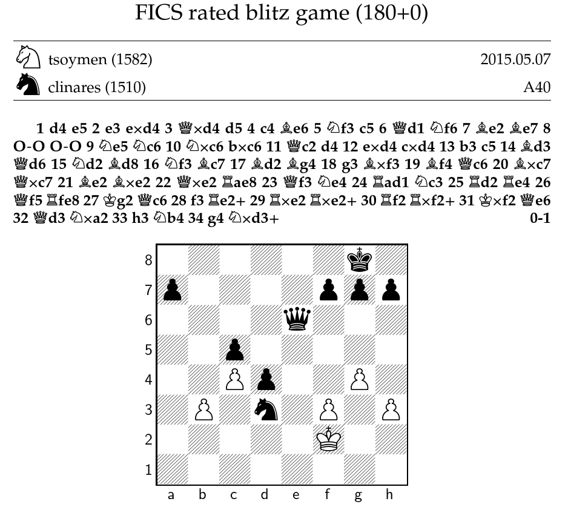
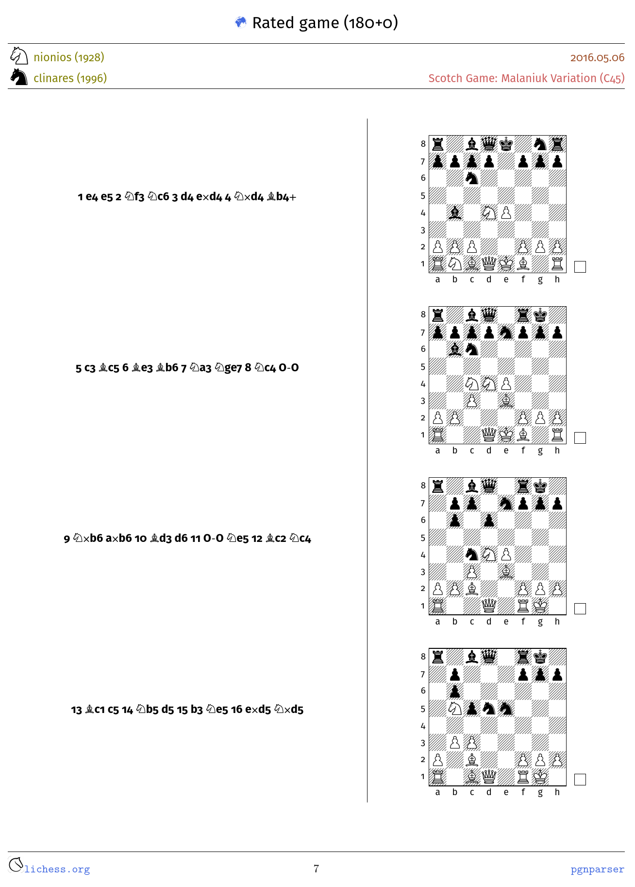

PGNparser -- May, 2015


# Introduction #

This tool parses PGN files, sort games by any criteria, filter games, and
produce histograms on any piece of data. In addition, it also generates LaTeX
files that can be processed with `pdflatex` to generate pdf files with the
contents of the games in any PGN file.

While it can be used for any PGN files, it is specifically designed to parse and
process the PGN files generated by [Lichess](https://lichess.org) and also
games from the [FICS database](http://www.ficsgames.org).

# External dependencies #

`pgnparser` uses the following third-party libraries

+ [expr](https://github.com/expr-lang/expr) library to parse statements written
  in Go. Indeed, this library made a huge difference in the development of
  `pgnparser`
  
+ [table](https://github.com/clinaresl/table) is used to generate fancy tables
  on the console output

# Install #

To install this program for development in Go:

``` sh
   $ go get -v github.com/clinaresl/pgnparser
```

To install an executable in your system using the Go toolchain:

``` sh
   $ go install github.com/clinaresl/pgnparser
```


# Usage #

`pgnparser` has a mandatory argument, `--file`, that must be used to provide a
path to a PGN file. If no more directives are given, `pgnparser` prints out
general information.

It also honours other optional arguments:

+ `list`: generates a table with information of every game parsed.

+ `play`: generates a table on the standard output where every game is played.
  It must be given an argument `nbplies`. The table shows a sequence of moves
  along with the resulting table every `nbplies` played.
  
  Even if this argument is not given, all games found in the input pgn parser
  are played to verify correctness. If a pgn game could not be properly parsed
  an error is produced and execution halts.
  
+ `filter`: generates a new pgn file with those games in the input pgn file
  satisfying the input criteria. Filtering criteria are described below.
  
+ `sort`: generates a new pgn file where games are sorted according to the given
  criteria. Sorting criteria are described below.
  
+ `histogram`: generates a table with a summary of information about the given
  variables. Histogram variables are described below.

Because some of these options can generate new files (namely, `--filter` and
`--sort`), it is possible to provide the directive `--output` with the name of
the pgn file to generate. If none is given, the file `output.pgn` is produced
overwritting its previous contents in case the file already exists.

All in all, `pgnparser` has been designed with flexibility of use in mind.
Sorting/filtering criteria and histogram variables result from this approach.
Also, tables produced with the directive `list` or LaTeX files can use different
templates affecting the look&feel of the output. To modify the design of the
table shown with `list` a new template can be provided with `table` and the path
to the template to use. To generate a LaTeX file it just suffices to provide a
path to the LaTeX template to use with `latex`.

These options can be used simultaneously. If so:

1. First, games found in the input pgn file are listed when using `list`, i.e.,
   `list` takes preceden over all the other arguments
   
2. If `filter` is given, games satisfying the given criteria are selected for
   the next operations ---including the generation of an output pgn file.
   
3. If `sort`is given, the current collection of games is sorted according to the
   given criteria ---either all games found in the input pgn file or those
   filtered when used in conjunction with `filter`
   
4. The current collection of games (either sorted or not), can be examined to
   produce a summary of information with `histogram` in the end

5. Finally, in case `latex` is used, the current collection of games is used to
   generate a LaTeX file showing its contents.

## Playing games ##

Games can be automatically played on the console. When using `play` with a
strictly positive argument a table is generated with the result of playing every
single game found in the input file where each game is started with information
given in the tags of the pgn file and then every row shows a number of moves and
the resulting board. The number of moves shown is the argument given to `play`.

For example, to play all games found in a pgn file:

``` sh
    $ pgnparser --file ... --play 30
```

produces an outcome like the following:

``` text
 ━━━━━━━━━━━━━━━━━━━━━━━━━━━━━━━━━━━━━━━━━━━━━━━━
    Result      : 0-1                            
    WhiteElo    : 1842                           
    PlyCount    : 38                             
    TimeControl : 180+0                          
    Opening     : Hungarian Opening              
    Event       : Rated game                     
    Site        : http://lichess.org/6LAIFOp6    
    White       : yerken                         
    Date        : 2016.05.06                     
    Variant     : Standard                       
    ECO         : A00                            
    Black       : clinares                       
    BlackElo    : 1989                           
    Termination : Normal                         
 ────────────────────────────────────────────────
  1. g3 e5                                       
  2. Bg2 d5                                      
  3. d3 c6                        ╔════════╗     
  4. Nc3 f5                       ║♜▒♝♝♚▒ ♜║     
  5. e4 fxe4                      ║♙ ▒ ▒ ♟♟║     
  6. dxe4 d4                      ║ ▒♞▒ ♞ ▒║     
  7. Nce2 Nf6                     ║▒ ▒ ♟ ▒ ║     
  8. c3 c5                        ║ ♟ ▒♙▒ ▒║     
  9. b4 b6                        ║▒ ♙ ▒♘♙ ║     
  10. a4 Be7                      ║ ▒ ▒♟♙♗♙║     
  11. a5 d3                       ║♖ ♗ ♔ ▒♖║     
  12. axb6 dxe2                   ╚════════╝     
  13. Qxd8+ Bxd8                                 
  14. bxa7 Nc6                                   
  15. Nf3 cxb4                                   
                                                 
                                  ╔════════╗     
                                  ║♜▒ ▒♚▒ ♜║     
                                  ║♙ ▒ ▒ ♟♟║     
  16. cxb4 Bb6                    ║♝▒ ▒ ♞ ▒║     
  17. b5 Nd4                      ║▒♙▒ ♟ ▒ ║     
  18. Nxd4 Bxd4                   ║ ▒ ♝♙▒ ▒║     
  19. Ra6 Bxa6                    ║▒ ▒ ▒ ♙ ║     
                                  ║ ▒ ▒♟♙♗♙║     
                                  ║▒ ♗ ♔ ▒♖║     
                                  ╚════════╝     

```

for every game found in the input pgn file.

## Filtering criteria ##

PGN files always start with a header and a set of tags that can be used for
filtering games. A filtering criteria just consists of an evaluable expression
in Go (which for the purpose here is much the same like almost any programming
language) that uses variables, either appearing in the header of the PGN file or
implemented by ` pgnparser` ---described below.

For example,

``` sh
    $ pgnparser --file ... --filter 'ECO=="C25"'
```

generates a pgn file named `output.pgn` with those games in the input pgn file
with `ECO=C25`. Note that the argument to `filter` is given between single
quotes because the evaluation of an expression in Go expects strings to be given
between double quotes. Variables can be combined in any way, e.g.:

``` sh
    $ pgnparser --file ... --filter 'ECO=="C25" && ((White=="clinares" && Result=="0-1") || (Black=="clinares" && Result=="1-0"))'
```


returns all games with opening C25 that were lost either with black or white by
one specific player.

`pgnparser` provides an additional variable, `Moves` which is reminiscent of
`PlyCount` used in FICS. Because this variable is not provided by lichess, it is
computed on the fly. It is a numerical variable and thus:

``` sh
    $ pgnparser --file ... --filter 'Moves<40 && ((White=="clinares" && Result=="0-1") || (Black=="clinares" && Result=="1-0"))'
```

filters all games lost by one specific player with either color in less than 40
moves ---or plies.

Note that the argument `--list` takes precedence over `filter` so that no
information is shown on the console of the result of filtering games. To see the
result use:

``` sh
    $ pgnparser --file ... --list
```
providing the name of the output file given to the precedence invocation of `pgnparser`


## Sorting criteria ##

Sorting criteria consists of a semicolon-separated string of different variables
(either those appearing in the tags of the pgn games or those provided by
`pgnparser`) preceded each by either `<` (for *ascending* order) or `>` ---for
*descending* order. For example to generate a pgn file showing first the most
recently played games and then breaking ties in ascending order of the number of
moves:

``` sh
    $ pgnparser --file ... --sort ">Date;<Moves"
```

Note that the argument `--list` takes precedence over `sort` so that no
information is shown on the console of the result of sorting games. To see
the result use:

``` sh
    $ pgnparser --file ... --list
```
providing the name of the output file given to the precedence invocation of `pgnparser`

## Histogram variables ##

`histogram` can be used to produce a summary (in tabular form) of the games in
the input pgn file. All sorts of variables can be used (either those appearing
in the tags of the games, or those provided by `pgnparser`). Histogram variables
must be given in a semicolon-separated string which uses either variables or
boolean expressions using variables:

+ For every variable given the histogram produces a count of the number of
  occurrences for every value found for the given variable
  
+ For every boolean expression given the histogram provides information on the
  frequency of every feasible outcome, either true or false. If any of these
  outcomes never takes place it is skipped in the output.

The histogram is sorted in ascending order of the values of the variables. In
case of using boolean expressions false is shown before true.

It is possible to provide an arbitrary number of istogram variables. If so,
observations are nested. For example, to produce a histogram on the number of
games won and lost with every opening found in the input pgn file:

``` sh
    $ pgnparser --file ... --histogram 'ECO;((White=="clinares") && (Result=="1-0")) || ((Black=="clinares") && (Result=="0-1"))'
```

produces a table with three columns: first, the ECO is shown; next, for every
value of ECO two rows are shown and tagged as either false or true. The third
column uses the frequency of the combined occurrence for every combination of
the ECO variable and the outcome of the boolean expression.

The output histogram shows a header with the name of each variable used. When
using boolean expressions the header is the entire boolean expression given but
this might not be very informative. It is because of this that any variable or
boolean expression can be preceded with a header and a colon just to be used in
the output table:

``` sh
    $ pgnparser --file ... --histogram ECO Opening: 'ECO;Win: ((White=="clinares") && (Result=="1-0")) || ((Black=="clinares") && (Result=="0-1"))'
```

produces a much more concise table with more comprehensive names for the
headers.

Note that the argument `--list` takes precedence over `histogram` so that no
information is shown on the console of the result of a histogram. To see the
result use:

``` sh
    $ pgnparser --file ... --list
```
providing the name of the output file given to the precedence invocation of `pgnparser`


## Example ##

The following command reads the contents of the file
`examples/mygames.pgn` and parse its contents. It shows then some
information on the standard output (note that values can be given
either using `=` or not):

```
#!sh

$ ./pgnparser --file=examples/mygames.pgn
```


The output shown is then of the form:

```
│ DBGameNo  │    Date       Time   │ White        ELO │ Black      ELO │ ECO │ Time  │ Moves │ Result │
━━━━━━━━━━━━━━━━━━━━━━━━━━━━━━━━━━━━━━━━━━━━━━━━━━━━━━━━━━━━━━━━━━━━━━━━━━━━━━━━━━━━━━━━━━━━━━━━━━━━━━━
│ 375431273 │ 2015.05.04  17:18:00 │ samotnik    1618 │ clinares  1520 │ C20 │ 180+0 │  60   │  1-0   │
│ 375458181 │ 2015.05.05  11:21:00 │ clinares    1514 │ walls     1532 │ C00 │ 180+0 │  67   │  ½-½   │
│ 375505558 │ 2015.05.06  14:10:00 │ indianpool  1582 │ clinares  1524 │ A40 │ 180+0 │  26   │  1-0   │
│ 375529641 │ 2015.05.07  05:54:00 │ clinares    1517 │ tsoymen   1575 │ D00 │ 180+0 │  10   │  0-1   │
│ 375529748 │ 2015.05.07  05:54:00 │ tsoymen     1582 │ clinares  1510 │ A40 │ 180+0 │  34   │  0-1   │
━━━━━━━━━━━━━━━━━━━━━━━━━━━━━━━━━━━━━━━━━━━━━━━━━━━━━━━━━━━━━━━━━━━━━━━━━━━━━━━━━━━━━━━━━━━━━━━━━━━━━━━


 # Games found: 5
```

If `--select` is used, then attention is restricted only to those
games that match the given query. For example:

```
#!sh

$ ./pgnparser --file examples/mygames.pgn
              --select "%White = 'tsoymen' and %Black = 'clinares'"
```

returns the last game in the table shown above.

If `--template` is given then a LaTeX file using the specified
template is automatically generated. For example (file
`templates/simple.tex` is included in this distribution):

```
#!sh

$ ./pgnparser --file examples/mygames.pgn
              --select "%White = 'tsoymen' and %Black = 'clinares'"
              --template templates/simple.tex
```

will generate a file called `mygames.pgn.tex` in the directory
`examples/`. The following image shows the only page generated:



Of course, LaTeX files reproduce an arbitrary number of games: all of
those accepted by the filter given, if any, or all games in the PGN
file if no filter is provided.

If a different template is used (`templates/sample-comments.tex`) the
output differs:



To sort games with multiple keywords, just provide a single string
with them, e.g.,

```
#!sh

$ ./pgnparser --file examples/mygames.pgn --sort "<%White >%PlyCount"
```

sorts all games in ascending order of the name of the white player
and, in case of a tie, it sorts games in decreasing order of the
number of plies (half-moves) of the game. The output is shown below:

```
│ DBGameNo  │    Date       Time   │ White        ELO │ Black      ELO │ ECO │ Time  │ Moves │ Result │
━━━━━━━━━━━━━━━━━━━━━━━━━━━━━━━━━━━━━━━━━━━━━━━━━━━━━━━━━━━━━━━━━━━━━━━━━━━━━━━━━━━━━━━━━━━━━━━━━━━━━━━
│ 375458181 │ 2015.05.05  11:21:00 │ clinares    1514 │ walls     1532 │ C00 │ 180+0 │  67   │  ½-½   │
│ 375529641 │ 2015.05.07  05:54:00 │ clinares    1517 │ tsoymen   1575 │ D00 │ 180+0 │  10   │  0-1   │
│ 375505558 │ 2015.05.06  14:10:00 │ indianpool  1582 │ clinares  1524 │ A40 │ 180+0 │  26   │  1-0   │
│ 375431273 │ 2015.05.04  17:18:00 │ samotnik    1618 │ clinares  1520 │ C20 │ 180+0 │  60   │  1-0   │
│ 375529748 │ 2015.05.07  05:54:00 │ tsoymen     1582 │ clinares  1510 │ A40 │ 180+0 │  34   │  0-1   │
━━━━━━━━━━━━━━━━━━━━━━━━━━━━━━━━━━━━━━━━━━━━━━━━━━━━━━━━━━━━━━━━━━━━━━━━━━━━━━━━━━━━━━━━━━━━━━━━━━━━━━━


 # Games found: 5
```

# License #

PGNparser is free software: you can redistribute it and/or modify it under
the terms of the GNU General Public License as published by the Free
Software Foundation, either version 3 of the License, or (at your
option) any later version.

PGNparser is distributed in the hope that it will be useful, but WITHOUT
ANY WARRANTY; without even the implied warranty of MERCHANTABILITY or
FITNESS FOR A PARTICULAR PURPOSE.  See the GNU General Public License
for more details.

You should have received a copy of the GNU General Public License
along with PGNparser.  If not, see <http://www.gnu.org/licenses/>.


# Author #

Carlos Linares Lopez <carlos.linares@uc3m.es>

