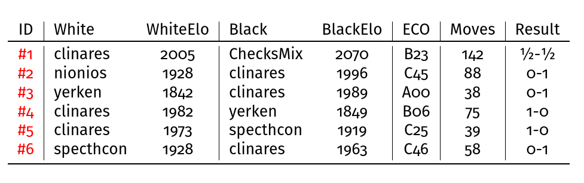

PGNparser -- May, 2015


# Introduction #

This tool parses PGN files, extracts information from them, filters
games and generate LaTeX files that can be processed with `pdflatex`
with specific collections of games.

While it can be used for any PGN files, it is specifically designed to
parse and process the PGN files generated by http://www.ficsgames.org

# Install #

First, clone the repository with:

    git clone https://github.com/clinaresl/pgnparser.git

from within your `$GOPATH/src/` directory. To compile `pgnparser`:

    $ go build

Finally, install the binary with:

    $ go install

And you are ready to execute:

    $ pgnparser --help

anywhere from your filesystem provided that the environment variable
`$PATH` contains the path to your `$GOPATH/bin/` directory


# Usage #

`pgnparser` has a mandatory argument that shall be given with `--file`
and shall consist of a path to a PGN file. This distribution comes
with various PGN files in the directory `examples/`. If no more
directives are given, `pgnparser` prints out a text table with the
headers of all games found in the PGN file.

It also recognizes other optional arguments: `--template`, `--select`
and `--sort`.

`--template` should be given with a path to a LaTeX template that is
used to automatically generate a LaTeX file with the transcription of
all games found in the PGN file. `pgnparser` acknowledges placeholders
that are conveniently substituted to produce the desired output. All
tags are of the form `%name`. Every *tag name* found in the header of
a game can be used as a placeholder (e.g., `%Date` is substituted by
the value of the tag `Date`). Additionally:

 * `%moves` is substituted by a list of the moves of a game.
 * `%moves_comments` is substituted by the list of the moves of every
   game with annotations and information of the elapsed move times if
   available.

`--select` can be used to filter games. If given, `pgnparser` only
accept those games that match the given query. A query consists of a
*logical expression* that relates *relational expressions* which can
consist of either constants (integer or string) or variables. As in
the case of the LaTeX templates, variables are preceded by the
character '%' and any tag appearing in the header of a PGN game can be
used as a variable. To obtain more information about expressions use
the directive `--help-expressions`. In case a query is requested with
`--select` any other operations (e.g., generating LaTeX files or
sorting games) are performed only over the filtered games.

`--sorting` can be used to sort any collection of chess games
retrieved from a PGN file. If given, it should be accompanied of an
arbitrary number of keys of the form `(<>) <variable>` where
`<variable>` should be a reference to a valid variable which shall be
prefixed with `%`. In case `<` is used, games are sorted in increasing
order of the given variable; otherwise, they are sorted in decreasing
order. Keys can be sorted so that in case of a tie of the first key,
the second one is used and so on. Additional help on sorting is
available with `--help-sort`.

`pgnparser` provides additional information with the commands `--help`
and `--version`


## Example ##

The following command reads the contents of the file
`examples/mygames.pgn` and parse its contents. It shows then some
information on the standard output (note that values can be given
either using `=` or not):

```
#!sh

$ ./pgnparser --file=examples/mygames.pgn
```


The output shown is then of the form:

```
│ DBGameNo  │    Date       Time   │ White        ELO │ Black      ELO │ ECO │ Time  │ Moves │ Result │
━━━━━━━━━━━━━━━━━━━━━━━━━━━━━━━━━━━━━━━━━━━━━━━━━━━━━━━━━━━━━━━━━━━━━━━━━━━━━━━━━━━━━━━━━━━━━━━━━━━━━━━
│ 375431273 │ 2015.05.04  17:18:00 │ samotnik    1618 │ clinares  1520 │ C20 │ 180+0 │  60   │  1-0   │
│ 375458181 │ 2015.05.05  11:21:00 │ clinares    1514 │ walls     1532 │ C00 │ 180+0 │  67   │  ½-½   │
│ 375505558 │ 2015.05.06  14:10:00 │ indianpool  1582 │ clinares  1524 │ A40 │ 180+0 │  26   │  1-0   │
│ 375529641 │ 2015.05.07  05:54:00 │ clinares    1517 │ tsoymen   1575 │ D00 │ 180+0 │  10   │  0-1   │
│ 375529748 │ 2015.05.07  05:54:00 │ tsoymen     1582 │ clinares  1510 │ A40 │ 180+0 │  34   │  0-1   │
━━━━━━━━━━━━━━━━━━━━━━━━━━━━━━━━━━━━━━━━━━━━━━━━━━━━━━━━━━━━━━━━━━━━━━━━━━━━━━━━━━━━━━━━━━━━━━━━━━━━━━━


 # Games found: 5
```

If `--select` is used, then attention is restricted only to those
games that match the given query. For example:

```
#!sh

$ ./pgnparser --file examples/mygames.pgn
              --select "%White = 'tsoymen' and %Black = 'clinares'"
```

returns the last game in the table shown above.

If `--template` is given then a LaTeX file using the specified
template is automatically generated. For example (file
`templates/simple.tex` is included in this distribution):

```
#!sh

$ ./pgnparser --file examples/mygames.pgn
              --select "%White = 'tsoymen' and %Black = 'clinares'"
              --template templates/simple.tex
```

will generate a file called `mygames.pgn.tex` in the directory
`examples/`. The following image shows the only page generated:



Of course, LaTeX files reproduce an arbitrary number of games: all of
those accepted by the filter given, if any, or all games in the PGN
file if no filter is provided.

If a different template is used (`templates/sample-comments.tex`) the
output differs:


To sort games with multiple keywords, just provide a single string
with them, e.g.,

```
#!sh

$ ./pgnparser --file examples/mygames.pgn --sort "<%White >%PlyCount"
```

sorts all games in ascending order of the name of the white player
and, in case of a tie, it sorts games in decreasing order of the
number of plies (half-moves) of the game. The output is shown below:

```
│ DBGameNo  │    Date       Time   │ White        ELO │ Black      ELO │ ECO │ Time  │ Moves │ Result │
━━━━━━━━━━━━━━━━━━━━━━━━━━━━━━━━━━━━━━━━━━━━━━━━━━━━━━━━━━━━━━━━━━━━━━━━━━━━━━━━━━━━━━━━━━━━━━━━━━━━━━━
│ 375458181 │ 2015.05.05  11:21:00 │ clinares    1514 │ walls     1532 │ C00 │ 180+0 │  67   │  ½-½   │
│ 375529641 │ 2015.05.07  05:54:00 │ clinares    1517 │ tsoymen   1575 │ D00 │ 180+0 │  10   │  0-1   │
│ 375505558 │ 2015.05.06  14:10:00 │ indianpool  1582 │ clinares  1524 │ A40 │ 180+0 │  26   │  1-0   │
│ 375431273 │ 2015.05.04  17:18:00 │ samotnik    1618 │ clinares  1520 │ C20 │ 180+0 │  60   │  1-0   │
│ 375529748 │ 2015.05.07  05:54:00 │ tsoymen     1582 │ clinares  1510 │ A40 │ 180+0 │  34   │  0-1   │
━━━━━━━━━━━━━━━━━━━━━━━━━━━━━━━━━━━━━━━━━━━━━━━━━━━━━━━━━━━━━━━━━━━━━━━━━━━━━━━━━━━━━━━━━━━━━━━━━━━━━━━


 # Games found: 5
```

# License #

PGNparser is free software: you can redistribute it and/or modify it under
the terms of the GNU General Public License as published by the Free
Software Foundation, either version 3 of the License, or (at your
option) any later version.

PGNparser is distributed in the hope that it will be useful, but WITHOUT
ANY WARRANTY; without even the implied warranty of MERCHANTABILITY or
FITNESS FOR A PARTICULAR PURPOSE.  See the GNU General Public License
for more details.

You should have received a copy of the GNU General Public License
along with PGNparser.  If not, see <http://www.gnu.org/licenses/>.


# Author #

Carlos Linares Lopez <carlos.linares@uc3m.es>

